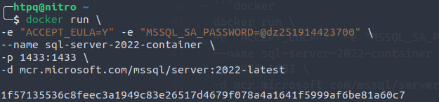

# DOCKER BASIC

## DOCKER COMMAND

##### IMAGE

###### docker ps

- Hiện các container đang bật.

###### docker ps -a

- Hiện tất cả các container.

###### docker images

- Hiện tất các các image đã download.

###### docker images --quiet

- Xem id của các images

###### docker rm --force [id image]

- Xóa Image có id là id-image

##### CONTAITER

###### docker rm [container-id]

- xóa contaiter (container bị xóa phải là container không chạy).
- nếu container đó đang chạy sẽ báo lỗi --> dừng container rồi xóa hoặc xóa --force.

###### docker rm -f [container-id]

- -f : --force : xóa cưỡng chế.
- 

## TẠO CONTAINER TỪ IMAGE.

###### docker run -d [image-name]

- -d : detach (background) mode --> chế độ chạy ngầm.
- [image-name] : mcr.microsoft.com/mssql/server:2022-latest --> sql server 20222.
- -e : environment variables
- -p : port ánh xạ từ host
- ```docker
  docker run \
  -e "ACCEPT_EULA=Y" -e "MSSQL_SA_PASSWORD=yourStrong(!)Password" \
  --name sql-server-2022-container \
  -p 1433:1433 \
  -d mcr.microsoft.com/mssql/server:2022-latest
  ```
- ```docker
  docker run \
  -e "ACCEPT_EULA=Y" -e "MSSQL_SA_PASSWORD=@dz251914423700" \
  --name sql-server-2022-container \
  -p 1433:1433 \
  -d mcr.microsoft.com/mssql/server:2022-latest
  ```
- 

###### docker logs [container-id]

- Xem các thay đổi diễn ra với container.

## CONNECT AZURE DATA STUDIO.

###### server : localhost, [host port]

###### username : sa

###### passwork : [passwork setup]

## DOCKER COMMAND INTER.

###### docker start [container-id]

- Khởi động container có id là [container-id]

###### docker stop [container-id]

- Stop docker container

## LƯU TRỮ SQL SERVER VỚI DOCKER VOLUME.

- Vấn đề : Khi chúng ta lỡ tay xóa container sql-server thì tất cả dữ liệu trong đó sẽ bị mất hết.
- Làm thể nào để giải quyết --> Ánh xạ (map) volume của container đến volume (Thư mục ) của host (PC) --> docker Volume. Khi xóa container thì không mất dữ liệu trên host.
- v "host's volume" : "container's volume.

  - host's volume : [Volume-name] --> volume default trên docker
  - container's volume :` /var/opt/mssql.`
  - stop container --> add volume map --> `docker run -v /home/htpq/Documents/SQL:/var/opt/mssql `
- ```docker
  docker run \
  -e "ACCEPT_EULA=Y" -e "MSSQL_SA_PASSWORD=@dz251914423700" \
  --name sql-server-2022-container \
  -p 1433:1433 \
  -v SQL:/var/opt/mssql \
  -d mcr.microsoft.com/mssql/server:2022-latest
  ```

###### docker volume ls

- Hiển thị các volume được ánh xạ (volume mặc định của docker).

###### docker volume inspect [volume-name]

- Hiện thông tin của volume ánh xạ, volume của container.
